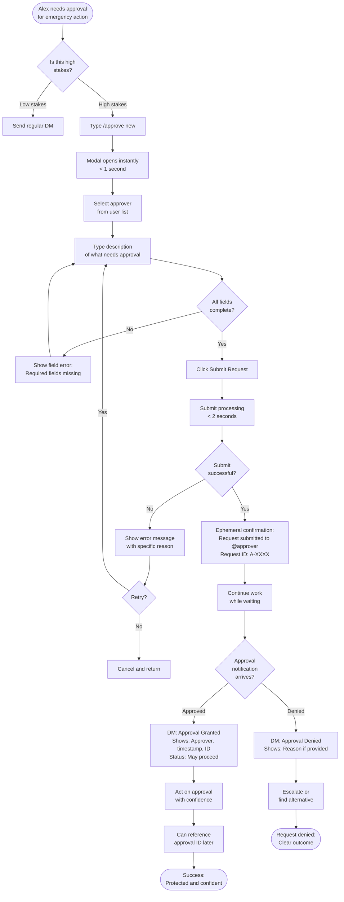
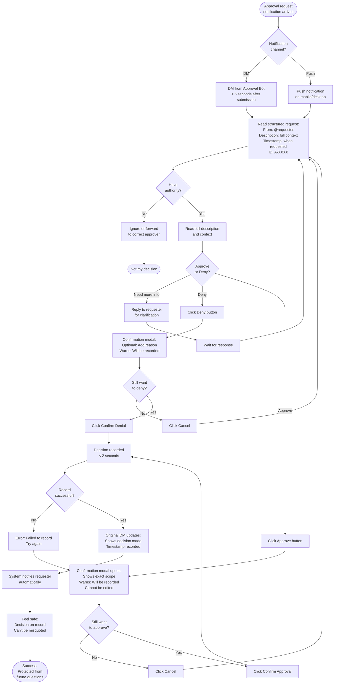
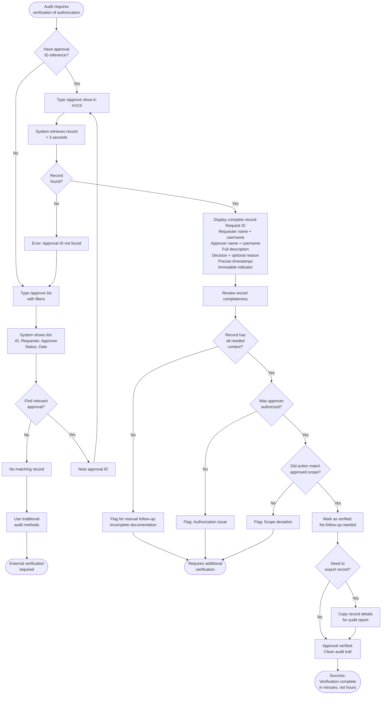

# UX Design Specification Mattermost-Plugin-Approver2

**Author:** Wayne
**Date:** 2026-01-10

---

## Executive Summary

### Project Vision

Mattermost-Plugin-Approver2 creates **"bridge authorization"** - a third category between informal chat approvals (fast but unaccountable) and formal approval systems (accountable but heavy). The plugin enables teams to make authorized decisions quickly while producing authoritative, auditable records.

**Core Value Proposition:**
- **Psychological safety for requesters** - confidence to act with explicit authorization
- **Procedural safety for organizations** - defensible records without workflow overhead
- **Clarity for auditors** - verification without reconstruction

**Design Principle:** "Intentional simplicity at the approval moment" is non-negotiable. Configuration may grow over time, but requesting and granting approval must never feel heavy.

### Target Users

**Alex Carter (Requester)** - Frontline operators (SREs, sales associates, military personnel)
- **Pain**: Uncertainty about whether informal approval is "good enough"
- **Success**: "I don't have to wonder if I'm covered"
- **UX Need**: One command, one modal, one confirmation - feels like sending a message, not filing a ticket

**Jordan Lee (Approver)** - Decision-makers who balance speed with judgment
- **Pain**: Being on the hook for decisions they can't defend later
- **Success**: "This protects me as much as it helps them"
- **UX Need**: One notification, one clear decision, optional comment - must feel official and intentional

**Morgan Patel (Auditor)** - Compliance officers who verify approvals after the fact
- **Pain**: Reconstructing intent from incomplete records
- **Success**: "I'm not reconstructing intent - I'm verifying a decision"
- **UX Need**: One command or reference, one clear record - no UI navigation, no interpretation

### UX Design Philosophy

**Core Approach: Native Mattermost Interaction Primitives**

The user experience is intentionally built from native Mattermost patterns rather than custom UI. This ensures the plugin feels familiar and trustworthy, requires no user training, behaves consistently across all clients, and works reliably in on-prem and air-gapped environments.

**The goal is not visual differentiation — it is clarity and authority.**

**UX Building Blocks:**
- **Slash commands** - Explicit intent (`/approve new`, `/approve list`)
- **Modals/Interactive dialogs** - Structured input with minimal friction
- **Direct messages** - Private, authoritative approval actions
- **Interactive message buttons** - Decisive actions (Approve/Deny)
- **Standard post formatting** - Consistency and readability

No custom layouts, dashboards, or embedded UIs are required for MVP.

**Why This Constraint Is Intentional:**

1. **Familiarity = Trust** - Users already trust Mattermost's UI for critical communication. Reusing interaction patterns reinforces that approvals are official, not experimental.

2. **Speed Over Expressiveness** - Approvals are human-paced decisions. The UX must minimize cognitive load, avoid navigation, and eliminate configuration friction. Every interaction happens where the user already is.

3. **Accessibility & Deployment Reality** - Custom UI increases maintenance cost, client inconsistency, and risk in locked-down environments. Native interactions work everywhere Mattermost works.

**UX Non-Goals (Intentional Exclusions):**
- No custom dashboards
- No admin UI
- No approval queues
- No policy configuration screens
- No visual design differentiation

These are not omissions — they are intentional exclusions to preserve clarity.

**Evolution Principle:** Future UX enhancements (templates, chains, roles) should layer onto existing primitives, never replace slash-command + modal + DM as the core flow, and remain optional and context-driven. If a future UX requires users to "go somewhere else," it's probably wrong.

### Key Design Challenges

1. **Balancing Speed with Authority** - The interface must feel "fast and official" simultaneously. Too casual lacks authority; too formal slows users down. This is the core UX tension.

2. **Multi-Modal Interaction Complexity** - Users interact via slash commands, modals, DM notifications, and interactive buttons across different contexts. Each transition must feel seamless and contextually appropriate.

3. **Progressive Disclosure of Complexity** - MVP is intentionally simple, but the system must elegantly accommodate future features without breaking the "simplicity at approval moment" principle.

4. **Notification Design for Different Urgency Levels** - Approvers receive notifications ranging from routine exceptions to 2 AM emergencies. DM notification design must support quick decision-making while preventing accidental approvals.

5. **Audit/History Interface** - Morgan needs to retrieve and verify records months later. The `/approve list` output must be simple (text-based in MVP) yet comprehensive for audit purposes.

### Design Opportunities

1. **Create a "Ritual of Authority"** - The confirmation dialog and notification design can create a psychological sense of official action through careful copy, visual treatment, and interaction design.

2. **Contextual Clarity Without Clutter** - Leverage native Mattermost patterns (user mentions, timestamps, DM threading) to provide rich context without custom dashboards or heavy UI.

3. **Zero-Config Onboarding** - First-time users should understand and use `/approve new` without documentation. The modal design, field labels, and help text become the entire onboarding experience.

## Core User Experience

### Defining Experience

The core experience of Mattermost-Plugin-Approver2 centers on **three simple, authoritative interactions**:

**For Requesters (Alex):**
Type `/approve new` → Fill 2-field modal (approver, description) → Submit → Receive outcome notification with approval ID

**For Approvers (Jordan):**
Receive structured DM notification → Review context (who, what, why) → Click Approve or Deny → Confirm decision

**For Auditors (Morgan):**
Type `/approve list` or reference approval ID → Retrieve complete, immutable record

Each interaction is designed to feel **fast and official simultaneously** - the defining characteristic of "bridge authorization."

### Platform Strategy

**Mattermost-Native Across All Clients:**
- **Web, Desktop (Windows/Mac/Linux), Mobile (iOS/Android)** - The plugin works identically across all Mattermost clients
- **Server-side plugin architecture** - All logic and data storage happens server-side, ensuring consistency
- **No offline requirements** - Requires connection to Mattermost server (standard for approval workflows)

**Input Modalities:**
- **Keyboard**: Slash commands, text input in modals
- **Click/Tap**: User selectors, buttons, confirmations
- **No custom gestures or platform-specific patterns** - Pure Mattermost standard interactions

**Device Capabilities Leveraged:**
- Mattermost notification system (DMs, push notifications)
- User directory and authentication
- Plugin KV store for persistence
- Standard modal and button components

### Effortless Interactions

Based on the "intentional simplicity" principle and performance NFRs, these interactions must be effortless:

**Initiating a Request:**
- One slash command (`/approve new`)
- Two required fields only (approver, description)
- Submit in under 2 seconds
- No configuration or setup required

**Approving or Denying:**
- Decision made from DM notification (no navigation)
- Two interactions: click button + confirm
- All context visible in notification
- Confirmation prevents accidental approvals without adding friction

**Understanding What's Being Approved:**
- Structured notification format shows: who is requesting, what they need, when it was requested
- User mentions ensure identity clarity
- No interpretation or follow-up questions needed

**Finding Past Approvals:**
- One slash command (`/approve list`)
- Results in under 3 seconds
- Text-based output (no dashboard navigation)
- Approval IDs can be directly referenced

### Critical Success Moments

**Alex's "Aha" Moment - From Uncertainty to Confidence:**
- **When**: Receiving the approval notification with timestamp and approval ID
- **Emotional shift**: "This isn't just permission - this is protection"
- **Design requirement**: Notification must feel official and complete
- **Success signal**: Alex proceeds immediately without documenting separately

**Jordan's "Aha" Moment - From Exposed to Protected:**
- **When**: Seeing the structured approval request notification (not just a casual DM)
- **Emotional shift**: "This is official. My decision matters"
- **Design requirement**: Visual and textual differentiation from informal messages
- **Success signal**: Jordan feels safe approving quickly

**Morgan's "Aha" Moment - From Reconstruction to Verification:**
- **When**: Retrieving a complete, unambiguous approval record
- **Emotional shift**: "I'm not reconstructing intent - I'm verifying a decision"
- **Design requirement**: Record contains all context without external references
- **Success signal**: Morgan closes the review without follow-up questions

### Experience Principles

These principles guide all UX design decisions:

**1. Speed Is Trust**
- Fast interactions don't compromise authority; they reinforce it
- Every operation completes in seconds, not minutes
- Performance is a feature, not a technical detail
- Users trust the tool because it keeps up with them

**2. Context Without Clutter**
- All necessary information is visible without navigation or interpretation
- Leverage native Mattermost patterns (mentions, timestamps, formatting)
- No dashboards or separate views required
- Rich context presented cleanly within familiar UI

**3. Explicit Over Implicit**
- Every action is intentional and confirmed
- No silent operations or assumptions
- Confirmation dialogs create deliberate decision moments
- Clarity prevents both accidental actions and ambiguity

**4. Ritual of Authority**
- Interactions create a psychological sense of official action through deliberate design
- Visual and textual patterns signal "this is different from casual chat"
- Structured formats and confirmation steps reinforce weight of decisions
- The UX itself communicates: "This matters. This will stand up later."

## Desired Emotional Response

### Primary Emotional Goals

The core emotional goal across all personas is **protection** - not just productivity, but psychological safety in decision-making.

**For Requesters (Alex): Protected Confidence**
- **Primary Emotion**: Confidence to act without uncertainty
- **Shift**: From "Am I covered?" to "I don't have to wonder"
- **Success**: Feels protected, not just permitted
- **Key Phrase**: "This isn't just permission - this is protection"

**For Approvers (Jordan): Protected Authority**
- **Primary Emotion**: Safe decisiveness without personal liability
- **Shift**: From "Am I exposing myself?" to "This protects me as much as it helps them"
- **Success**: Can approve quickly without second-guessing
- **Key Phrase**: "I can approve quickly without exposing myself"

**For Auditors (Morgan): Verification Confidence**
- **Primary Emotion**: Trust in the record without interpretation effort
- **Shift**: From "I have to reconstruct this" to "I'm verifying, not reconstructing"
- **Success**: Clarity without follow-up questions
- **Key Phrase**: "I don't have to guess what happened"

**Cross-Persona Theme:**
This is an **emotional safety mechanism**, not just a productivity tool. All three personas need to feel protected by the system - from different risks, but with the same core need.

### Emotional Journey Mapping

**First Discovery (Moment 0):**
- **Desired**: "This is exactly what I needed" - immediate problem recognition
- **Avoid**: Skepticism about simplicity ("Is this secure enough for our use case?")
- **Design Support**: Clear positioning of "bridge authorization" concept, explicit security messaging

**During Core Action (Moments 1-3):**
- **Desired**: Fast + official simultaneously - no trade-off between speed and authority
- **Avoid**: Either casual-therefore-sketchy OR formal-therefore-slow
- **Design Support**: Structured interactions with confirmation steps; performance within seconds

**After Task Completion (Moment 4):**
- **Desired**: Relieved, protected, confident to act immediately
- **Avoid**: Uncertainty ("Did that actually work? Is the record really there?")
- **Design Support**: Explicit confirmation messages with approval IDs; immediate notifications

**When Something Goes Wrong (Error States):**
- **Desired**: Informed, clear about what failed and why
- **Avoid**: Silent failures, ambiguous error states that create doubt
- **Design Support**: Clear error messages; graceful degradation (NFR-R4)

**Return Usage (Habit Formation):**
- **Desired**: Habitual trust, muscle memory, behavioral shift to tool over DMs
- **Avoid**: Second-guessing ("Should I have used this? Was that the right way?")
- **Design Support**: Consistent patterns, zero configuration changes, predictable outcomes

### Micro-Emotions

**Confidence vs. Confusion:**
- **Goal**: Users should feel confident at every step
- **Critical Moments**: Selecting approver, understanding what was approved, retrieving records
- **Design Response**: Clear field labels, structured notifications, explicit scope

**Trust vs. Skepticism:**
- **Goal**: Users should trust the system from first use
- **Critical Moments**: First approval submission, first retrieval of old record
- **Design Response**: Immediate confirmations, immutable records, official tone

**Accomplishment vs. Frustration:**
- **Goal**: Task completion should feel smooth and successful
- **Critical Moments**: Request submitted, approval received, record retrieved
- **Design Response**: Speed (2-5 second responses), clear success feedback

**Safety vs. Exposure:**
- **Goal**: Users should feel protected, not vulnerable
- **Critical Moments**: Making decisions, being audited, acting on approval
- **Design Response**: Confirmation dialogs, complete records, explicit authority

**Calm vs. Anxiety:**
- **Goal**: Even in urgent situations, the tool should feel calming
- **Critical Moments**: 2 AM incident approvals, emergency decisions
- **Design Response**: No surprises, predictable behavior, clear outcomes

### Design Implications

**To Create Protected Confidence (Alex):**
- Immediate confirmation after request submission
- Approval notification includes explicit approval ID
- Language emphasizes "official record" and "defensible authorization"
- No ambiguity in approval scope

**To Create Protected Authority (Jordan):**
- Visual differentiation from casual DMs
- Structured request format (who, what, when)
- Confirmation dialog before finalizing decision
- Complete context visible without navigation
- Language emphasizes "your decision is recorded"

**To Create Verification Confidence (Morgan):**
- Records include all context in one place
- No interpretation required (explicit fields)
- Fast retrieval (under 3 seconds)
- Immutable timestamps and identities
- Language emphasizes "complete record" and "unambiguous"

**To Maintain Speed Without Sacrificing Authority:**
- Use native Mattermost patterns (familiar = fast)
- Confirmation steps are fast but deliberate (one click + confirm)
- Performance targets are emotional design (2-5 seconds = trust)
- No loading states over 3 seconds

**To Build Trust Through Transparency:**
- No silent operations - always confirm actions
- Errors are explicit and actionable (never mysterious)
- Records are complete and self-contained
- System behaves predictably every time

### Emotional Design Principles

**1. Protection First, Productivity Second**
- Every design decision should ask: "Does this make users feel protected?"
- Speed matters because it reduces anxiety, not just saves time
- Authority matters because it creates confidence, not just compliance

**2. Explicit Over Smooth**
- Confirmation dialogs are not friction - they are emotional design
- Structured formats are not clutter - they create trust
- Clear outcomes are not verbose - they eliminate doubt

**3. Consistency Is Comfort**
- Predictable behavior creates calm in urgent situations
- No surprises, no exceptions, no special cases
- Every interaction follows the same pattern

**4. Authority Through Ritual**
- The UX itself creates psychological weight
- Confirmation steps are deliberate moments of decision
- Language and structure signal "this matters"
- The tool communicates: "This will stand up later"

## UX Pattern Analysis & Inspiration

### Inspiring Products Analysis

The primary UX inspiration comes from systems that successfully balance speed with authority through clarity rather than complexity.

**Mattermost Native Patterns:**

Mattermost's existing interaction patterns already establish the foundation for authoritative, fast interactions:

- **Slash Commands** (`/away`, `/invite`, `/playbook run`) - Signal explicit intent, immediate recognition as "this is a command, not casual chat"
- **Interactive Dialogs/Modals** - Structured input without context switching, fields clearly labeled, submit/cancel explicit
- **Action Buttons in Messages** - One-click decisions with visual prominence, differentiated from regular message text
- **Direct Message Notifications** - Private, authoritative communication channel, inherited trust from Mattermost security model

**Pattern Strength:** Familiar + Fast = Trusted. Users already know these patterns work, so reusing them creates instant credibility.

**Incident Management Tools (PagerDuty, Opsgenie, etc.):**

Tools designed for high-stakes, time-sensitive decisions under pressure:

- **Quick Acknowledgment** - One-click "acknowledge incident" creates official record instantly
- **Structured Context** - Who triggered, what's affected, when it started always visible at a glance
- **Confirmation Patterns** - Critical actions (resolve, escalate) require explicit confirmation to prevent accidents
- **Time-Sensitive Design** - Built for 2 AM decisions when cognitive load is high
- **Clear Outcomes** - Every action produces explicit confirmation and updates status visibly

**Pattern Strength:** Speed doesn't sacrifice authority. These tools prove that fast interactions can feel official through deliberate design.

**GitHub Pull Request Approvals:**

Code review approvals as a model for explicit, durable decision-making:

- **Clear Scope** - Exactly what's being approved is visible (files changed, diff, description)
- **Explicit Decision Types** - Approve/Request Changes/Comment are distinct actions with clear intent
- **Immutable Record** - Approvals are timestamped, attributed, cannot be quietly edited
- **Context Preservation** - Full discussion thread + decision visible together, no reconstruction needed
- **Status Indicators** - Visual badges show approval state (approved, changes requested, pending)

**Pattern Strength:** Official through clarity, not ceremony. No heavy workflow, just clear context + explicit decision + permanent record.

### Transferable UX Patterns

**Navigation Patterns:**

**Slash Command as Primary Entry** (from Mattermost, incident tools)
- Users type a command to signal intent
- Works across all clients (web, desktop, mobile)
- Zero navigation required
- **Application**: `/approve new` as primary entry point for requests

**Modal for Structured Input** (from Mattermost, GitHub)
- Opens in-place without context switching
- Clear field labels guide users
- Submit/Cancel always visible
- **Application**: Approval request modal with approver selector + description field

**Interaction Patterns:**

**Confirmation Dialog for Critical Actions** (from incident tools, GitHub)
- Prevents accidental decisions
- Creates deliberate moment of authority
- Fast but intentional (one click + confirm)
- **Application**: Approver clicks Approve/Deny, then confirms in dialog

**Structured Notification Format** (from all three sources)
- Who did what, when, why visible at a glance
- Actionable elements (buttons) visually prominent
- Context complete without external references
- **Application**: Approval request DM with all context + Approve/Deny buttons

**Action Buttons in Messages** (from Mattermost, incident tools)
- Decisions made inline without navigation
- Visual prominence signals importance
- State changes reflected immediately
- **Application**: Approve/Deny buttons in DM notification

**Visual Patterns:**

**User Mentions for Identity Clarity** (from Mattermost, GitHub)
- @username format ensures unambiguous identity
- Leverages existing user recognition patterns
- No custom identity display needed
- **Application**: Requester and approver always shown as @mentions

**Timestamp Precision** (from all three sources)
- Exact timestamp (not "2 hours ago") for official records
- System-generated (not user-editable)
- Consistent timezone handling
- **Application**: All approval records include precise timestamps

**Status Indicators** (from GitHub, incident tools)
- Visual badges or labels show current state
- Color-coded for quick recognition (but not essential)
- Text labels work across all themes
- **Application**: Approval status (Pending/Approved/Denied) in `/approve list` output

### Anti-Patterns to Avoid

**Overly Casual Tone** (anti-pattern from informal chat)
- Using casual language for official actions undermines authority
- "Yeah, approved!" feels sketchy, not official
- **Avoid**: Casual confirmations, emoji-heavy messaging (unless user explicitly wants it)
- **Instead**: Clear, professional language: "Approval request approved by @jordan at 2026-01-10 02:14:23 UTC"

**Silent Operations** (anti-pattern from poor UX design)
- Actions that complete without confirmation create doubt
- Users wonder: "Did that work? Is it recorded?"
- **Avoid**: Submitting requests or recording decisions without explicit confirmation
- **Instead**: Always confirm actions explicitly with success messages

**Complex Workflows** (anti-pattern from enterprise tools)
- Requiring configuration before first use creates friction
- Multi-step wizards slow down urgent decisions
- **Avoid**: Setup screens, workflow builders, admin configuration requirements
- **Instead**: Zero-config first use, optional configuration for future versions

**Custom UI for Basic Interactions** (anti-pattern from over-engineered plugins)
- Custom dashboards or embedded UIs add maintenance burden
- Breaks consistency with Mattermost look-and-feel
- May not work reliably across all clients
- **Avoid**: Custom React components, embedded views, custom navigation
- **Instead**: Native Mattermost patterns only (modals, DMs, slash commands)

**Ambiguous Scope** (anti-pattern from informal approvals)
- "Approved" without context leaves interpretation open
- What was approved? For how long? With what limits?
- **Avoid**: Generic approvals without explicit description
- **Instead**: Approval record always includes full request description

**Edit/Delete of Official Records** (anti-pattern from mutable systems)
- Allowing edits undermines trust in immutability
- Deleting approvals destroys audit trail
- **Avoid**: Edit buttons, delete actions on finalized approvals
- **Instead**: Append-only records, no modifications after finalization

### Design Inspiration Strategy

**What to Adopt Directly:**

- **Slash command entry** - Proven pattern for explicit intent, works everywhere
- **Modal dialogs for structured input** - Fast, familiar, no navigation required
- **Action buttons in DMs** - One-click decisions, visually prominent
- **Confirmation dialogs** - Proven pattern for preventing accidents while maintaining speed
- **User mentions for identity** - Leverages existing Mattermost patterns, unambiguous
- **Explicit success confirmations** - Every action produces clear outcome message

**What to Adapt:**

- **GitHub's "scope clarity"** - Adapt by requiring explicit description field, showing full context in notifications
- **Incident tool's "time-sensitive design"** - Adapt by optimizing for 2 AM decisions (clear even when tired)
- **GitHub's "immutable record" approach** - Adapt using plugin KV store with append-only design

**What to Avoid:**

- **Complex approval workflows** - Conflicts with "intentional simplicity" principle
- **Custom UI components** - Doesn't fit Mattermost-native constraint
- **Casual tone in confirmations** - Undermines authority and trust
- **Configuration requirements** - Conflicts with zero-config onboarding goal

**Guiding Principle:**
This plugin applies the proven philosophy of incident management and code review tools to ad-hoc approvals: actions feel official through **clarity and confirmation, not complexity**. The UX itself communicates weight without adding friction.

## Design System Foundation

### Design System Choice

**Mattermost Native Component System**

Mattermost-Plugin-Approver2 uses **exclusively Mattermost's built-in interaction primitives** with zero custom UI components. This is an intentional design decision, not a limitation.

**Component Inventory:**

- **Slash Commands** - Command entry (`/approve new`, `/approve list`)
- **Interactive Modals/Dialogs** - Structured input forms (user selectors, text fields, submit/cancel buttons)
- **Direct Messages** - Private notification delivery
- **Action Buttons in Messages** - Interactive decision buttons (Approve/Deny)
- **Standard Message Formatting** - Markdown, user mentions, timestamps
- **Confirmation Dialogs** - Modal confirmations for critical actions

**No Custom Components:**
- No custom React components
- No embedded views or dashboards
- No custom navigation
- No custom visual styling beyond Mattermost defaults

### Rationale for Selection

**Familiarity Creates Trust**

Users already trust Mattermost's UI for critical communication. Reusing identical interaction patterns reinforces that approvals are official, not experimental. There's zero learning curve because every component is already familiar.

**Speed Through Simplicity**

Native components work identically across web, desktop (Windows/Mac/Linux), and mobile (iOS/Android) with zero additional testing burden. No cross-client UI inconsistencies, no mobile-specific layouts, no responsive design complexity.

**Deployment Reality**

Custom UI components add:
- Maintenance burden (React version upgrades, component library updates)
- Client inconsistency risk (what works on web may break on mobile)
- Deployment complexity (bundle size, build process)
- Testing surface (cross-browser, cross-platform UI testing)

Native components work everywhere Mattermost works, including highly restricted on-prem and air-gapped environments.

**Aligns with Product Philosophy**

From the UX principles: "The goal is not visual differentiation — it is clarity and authority."

Authority comes from:
- Structured interactions (modals, confirmations)
- Explicit language and format
- Immutable records
- Fast, predictable behavior

Not from:
- Custom visual design
- Novel interaction patterns
- Branded UI components

### Implementation Approach

**Backend (Go):**
- Mattermost Plugin API for all user interactions
- Slash command registration and handling
- Modal/dialog creation and submission handling
- Direct message sending
- Action button handling
- KV store for data persistence

**Frontend (React) - Minimal:**
- Only if needed for modal customization beyond standard Mattermost dialogs
- If used, strictly follows Mattermost plugin frontend patterns
- No custom styling or components

**API Surface:**
- Plugin exposes no custom REST endpoints in MVP
- All interactions via Mattermost's standard plugin hooks
- Slash commands, message actions, modal submissions

### Customization Strategy

**What Can Be Customized:**

**Copy/Language:**
- Modal titles and field labels
- Button labels (Approve/Deny/Confirm/Cancel)
- Notification message formatting
- Error messages and help text
- Professional tone that signals authority

**Message Structure:**
- Order and formatting of context fields
- Use of Markdown formatting (bold, code blocks, lists)
- User mention formatting (@username)
- Timestamp display format

**Confirmation Patterns:**
- When to show confirmation dialogs
- Confirmation message wording
- Button arrangement in confirmations

**What Cannot Be Customized (Intentional Constraints):**

- Visual styling (colors, fonts, spacing) - inherited from Mattermost theme
- Component types (can't replace modals with custom UI)
- Navigation patterns (can't add custom navigation)
- Layout (Mattermost controls message and modal layout)

**Future Customization (Post-MVP):**

If the plugin evolves to support templates, approval chains, or roles, these features will still use native Mattermost patterns:
- Templates: Dropdown selector in modal
- Chains: Sequential DM notifications
- Roles: User group selectors

No custom UI required for any planned future feature.

### Design Tokens

Since visual styling is inherited from Mattermost, traditional design tokens (colors, typography, spacing) are not defined. Instead, **semantic patterns** serve as design tokens:

**Interaction Tokens:**
- **Command Entry**: Slash command pattern (`/approve <action>`)
- **Structured Input**: Modal with 2-4 labeled fields maximum
- **Decisive Action**: Action buttons with clear labels + confirmation
- **Notification**: DM with structured context + optional actions
- **List Output**: Text-based table or bulleted list

**Language Tokens:**
- **Authority**: "Approval request", "approved by", "official record"
- **Clarity**: Always show who, what, when explicitly
- **Confirmation**: "Confirm you are approving..." before finalizing
- **Completion**: "Approval request submitted", "Decision recorded"

**Timing Tokens:**
- **Immediate**: <2 seconds for user-initiated actions
- **Fast**: <5 seconds for notifications and async operations
- **Retrieval**: <3 seconds for history/record lookup

These semantic patterns ensure consistency across the plugin without requiring visual design tokens.

## Defining Core Experience

### The Defining Experience

**"Seconds from Request to Official Record"**

The defining interaction of Mattermost-Plugin-Approver2 is: **"I can get an official approval in the time it takes to send a DM."**

This is the core experience that, if nailed perfectly, makes everything else follow. The entire flow from urgent need ("I need approval") to defensible outcome ("I have an official, immutable record") happens in 15-30 seconds total.

**The Flow:**
1. Alex types `/approve new` (1 second)
2. Modal opens immediately (<1 second)
3. Alex selects approver, types description (5-10 seconds)
4. Submits - confirmation appears (<2 seconds)
5. Jordan receives DM notification (<5 seconds from submission)
6. Jordan clicks Approve, confirms decision (2 interactions, 3-5 seconds)
7. Alex receives outcome notification with approval ID (<5 seconds from decision)
8. Complete official record exists forever

**Total time: 15-30 seconds from need to official record.**

This is **DM speed with formal system authority** - breaking the false choice users have accepted as inevitable.

**What Makes This Special:**

This isn't just "fast approval workflow" - it's **chat-native authorization**. The speed comes from staying in Mattermost's conversation flow, not extracting users to external systems. The authority comes from structured interactions and immutable records, not complexity or ceremony.

When users describe this to colleagues, they say: "It's like getting a DM approval, except it actually counts."

### User Mental Model

**Current Mental Model (False Choice):**

Users approach approval requests with an internalized trade-off they believe is unavoidable:

- **Fast = Informal**: DMs and chat messages are quick but not defensible
  - "I can get an answer in seconds, but will it hold up later?"
  - Anxiety about whether informal approval is "good enough"
  - Screenshot workarounds that still feel sketchy

- **Official = Slow**: Formal workflow systems are authoritative but take minutes/hours
  - "This creates a real record, but I'll be waiting forever"
  - Context switching breaks flow during urgent situations
  - Overhead feels disproportionate to simple yes/no decisions

**Users accept this trade-off as inevitable reality.** They choose DMs when speed matters and formal workflows when authority matters, never expecting both simultaneously.

**New Mental Model (Breaking the False Choice):**

This plugin challenges users' expectations by proving speed and authority aren't mutually exclusive:

- **Fast AND Official**: Chat-native speed with formal system authority
  - "I got official approval faster than I expected an informal DM response"
  - The confirmation dialog signals "this is official" without slowing users down
  - Approval ID creates tangible proof: "This is real. This will stand up later."

**The "Aha" Moment:**

Users don't expect both speed and authority. When they experience it, the realization shifts their behavior:

- **Alex's moment**: "This isn't just permission - this is protection" (receiving approval notification with ID)
- **Jordan's moment**: "This is official. My decision matters" (seeing structured request, not casual DM)
- **Morgan's moment**: "I'm verifying, not reconstructing" (retrieving complete record instantly)

The mental model shift is from accepting trade-offs to expecting integration.

**Current Solutions - What Users Love/Hate:**

**Direct Messages:**
- ✅ Love: Speed, context preservation, no friction
- ❌ Hate: Not defensible, difficult to retrieve, informal tone undermines confidence
- 🔧 Workaround: Screenshots (clunky, still informal, not immutable)

**ITSM/Formal Workflows (ServiceNow, JIRA, etc.):**
- ✅ Love: Authoritative records, audit trails, clear scope
- ❌ Hate: Context switching, slow response times, disproportionate overhead for simple requests
- 🔧 Workaround: Skip it when speed matters, accept risk

**Email Approvals:**
- ✅ Love: Timestamped, searchable, familiar
- ❌ Hate: Not structured, easy to miss, requires reconstruction, no confirmation loop
- 🔧 Workaround: Follow-up messages, forwarding to auditors later

**Users' Shortcuts:**
- Taking screenshots of DM approvals (preservation attempt, but still informal)
- Adding "on the record" language to chat messages (psychological signal, but not systematic)
- Following up informal approvals with tickets later (doubling work, losing timestamp fidelity)

None of these workarounds solve the core problem - they just reveal the gap this plugin fills.

### Success Criteria for Core Experience

**"This Just Works" Indicators:**

**Speed Perception:**
- User types `/approve new` and modal appears instantly (no loading state)
- Submit button responds immediately (within 1 second)
- Notifications arrive before users switch contexts (within 5 seconds)
- No operation takes longer than 3 seconds

**Confidence Building:**
- Explicit confirmation messages after every action
- Approval ID generated and displayed immediately
- Language reinforces "this is official": "Approval request submitted", "Decision recorded"
- No ambiguity about what was approved or by whom

**Zero Friction:**
- First-time use requires no setup, configuration, or documentation
- Modal field labels are self-explanatory
- Error messages are actionable, not mysterious
- User never thinks "How do I...?" - it's obvious

**Emotional Success:**
- Alex feels relief, not anxiety: "I'm covered"
- Jordan feels safe, not exposed: "This protects me too"
- Morgan feels trust, not skepticism: "This record is complete"

**Behavioral Success:**

The ultimate success indicator is **behavioral change**: when stakes are high, users choose this tool over DMs without being prompted. This shift happens when:

1. **First success experience** - User completes full flow once successfully
2. **Return usage** - User chooses tool again for next high-stakes approval
3. **Pattern establishment** - Team members start saying "put it through the approval tool" instead of DMing
4. **Trust formation** - Users stop taking screenshots or creating backup records

**Automatic Behaviors (What Happens Without User Effort):**

- Approval ID generation (user doesn't create it)
- Timestamp recording (system-generated, immutable)
- Identity verification (leverages Mattermost authentication)
- Record persistence (automatic KV store writes)
- Notification delivery (DMs sent automatically)

Users should never think about these - they just work.

### Novel vs. Established Patterns

**Pattern Classification: Established with Conceptual Innovation**

The interaction patterns are deliberately **established** (not novel), but the **concept** they're applied to is innovative.

**Established Patterns Used:**

All interaction patterns are proven, familiar Mattermost behaviors:

- **Slash commands** - Users already know `/away`, `/invite`, `/playbook run`
- **Modal input** - Standard Mattermost pattern for structured data entry
- **Action buttons in DMs** - Common in incident management plugins and integrations
- **Confirmation dialogs** - Proven pattern for preventing accidental actions
- **User mentions** - Universal Mattermost identity pattern

**Why Established Patterns Matter:**

- **Zero learning curve** - Users already know how to interact with these components
- **Instant credibility** - Familiar patterns signal "this is legitimate, not experimental"
- **Cross-platform consistency** - Established patterns work identically on web, desktop, mobile
- **Reduced risk** - No user education required, no novel pattern failure modes

**Conceptual Innovation:**

The novelty isn't in **how** users interact - it's in **what** they're accomplishing with familiar interactions:

- **Novel concept**: "Bridge authorization" - official enough to act on, not replacing formal systems
- **Novel application**: Using chat-native patterns for official decision-making
- **Novel positioning**: Speed and authority as compatible, not mutually exclusive

**Teaching Strategy:**

Because interaction patterns are established, we don't need to teach **how** - we need to communicate **why** and **when**:

- **Why use this?** "When you need official approval but can't wait for formal workflows"
- **When to use it?** "When stakes are high and informal DMs won't stand up later"
- **What makes it official?** "Immutable records, explicit confirmation, complete audit trail"

**Familiar Metaphors:**

- **"Like sending a DM, but it counts"** - Speed metaphor
- **"GitHub approve button for chat"** - Authority metaphor
- **"Official stamp in conversation"** - Legitimacy metaphor

Users understand these metaphors immediately because they reference established patterns.

**Our Unique Twist on Established Patterns:**

The innovation is **combination and context**, not individual components:

- Slash commands + modals + action buttons **already exist**
- Using them for **official authorization** in chat is novel
- The **speed + authority combination** is the differentiator
- The **"ritual of authority" through confirmation** elevates familiar patterns to formal decisions

### Experience Mechanics

**Core Experience: Full Flow Breakdown**

#### 1. Initiation: "I Need Approval"

**How User Starts:**
- Types `/approve new` in any Mattermost text input (channel, DM, thread)
- Slash command triggers instantly, no delay or loading state

**What Triggers This Action:**
- **Urgent need** - Alex realizes they need authorization to proceed with action
- **High stakes** - Informal approval won't be defensible if questioned later
- **Time sensitivity** - Waiting for formal workflow would block progress

**Mental State at Initiation:**
- Anxiety: "I need to move fast but need cover"
- Recognition: "I should use the approval tool"
- Expectation: "This should be quick"

#### 2. Interaction: Requesting Approval

**Step 2a: Modal Opens**

- **System response**: Modal appears immediately (<1 second)
- **Visual state**: Clean, focused modal with two labeled fields
- **User perception**: "This is structured, not casual"

**Step 2b: Select Approver**

- **User action**: Click "Select approver" field
- **System response**: Mattermost user selector opens (standard component)
- **User selects**: Types name or scrolls to find approver
- **Visual feedback**: Selected user appears with @mention format
- **User perception**: "The system knows who this is - it's official"

**Step 2c: Describe Request**

- **User action**: Click "What needs approval?" text field
- **User types**: Clear description of what requires authorization
  - Example: "Emergency rollback of payment-config-v2 deployment - causing 15% payment failures"
- **Character guidance**: Field accepts reasonable description length (500-1000 chars)
- **User perception**: "I need to be specific - this is on the record"

**Step 2d: Submit**

- **User action**: Clicks "Submit" button
- **System response**: Modal closes, ephemeral message appears confirming submission
- **Confirmation message**: "Approval request submitted to @jordan. Request ID: A-1847"
- **Visual feedback**: Request ID is copyable, prominently displayed
- **User perception**: "It's done. I have proof."

**Time: 5-10 seconds for input, <2 seconds for system response**

#### 3. Feedback: Waiting for Decision

**For Requester (Alex):**

- **Immediate confirmation**: Ephemeral message with request ID
- **Status awareness**: Knows request is with approver
- **No active waiting**: Continues work, will be notified when decision is made
- **Mental state shift**: From anxiety to confidence - "I'm covered while I wait"

**For Approver (Jordan):**

**Step 3a: Notification Arrival**

- **System response**: DM from Approval Bot arrives within 5 seconds of submission
- **Visual treatment**: Structured message, clearly differentiated from casual DMs
- **Content visible**:
  - Header: "📋 Approval Request"
  - Requester: "@alex (Alex Carter)"
  - Description: Full request text
  - Timestamp: When request was submitted
  - Context: Any relevant metadata
  - Actions: Two prominent buttons: [Approve] [Deny]

**Step 3b: Jordan Reviews Context**

- **User action**: Reads request description
- **Information assessment**: "Do I have authority? Is this reasonable?"
- **Mental state**: "This is official. My decision matters. I need to be sure."
- **Time to decide**: Seconds to minutes depending on complexity

**Step 3c: Jordan Makes Decision**

- **User action**: Clicks [Approve] or [Deny] button
- **System response**: Confirmation dialog appears immediately
- **Confirmation content**:
  - "Confirm you are approving: [description]"
  - Clear [Confirm] and [Cancel] buttons
  - Explicit language emphasizing finality

**Step 3d: Jordan Confirms**

- **User action**: Clicks [Confirm]
- **System response**:
  - Dialog closes
  - Original DM updates to show decision
  - Confirmation message: "Decision recorded. @alex has been notified."
- **User perception**: "It's official. I'm on the record. I'm protected."

**Time: Instant notification delivery, 3-5 seconds for decision + confirmation**

#### 4. Completion: Outcome and Record

**For Requester (Alex):**

**Step 4a: Outcome Notification**

- **System response**: DM from Approval Bot arrives within 5 seconds of decision
- **Content visible**:
  - Header: "✅ Approval Request Approved" (or ❌ Denied)
  - Approver: "@jordan (Jordan Lee)"
  - Original description: Quoted for context
  - Timestamp: When decision was made
  - Approval ID: "Request ID: A-1847"
  - Action taken: "You may proceed with [action]" (if approved)

**Step 4b: Alex Proceeds**

- **User action**: Acts on approval (e.g., executes rollback)
- **Mental state**: Confident, protected - "I have official authorization"
- **Reference available**: Can copy approval ID for documentation

**For Auditor (Morgan) - Future Retrieval:**

**Step 4c: Record Retrieval (Later)**

- **User action**: Types `/approve list` or `/approve get A-1847`
- **System response**: Complete approval record displayed (<3 seconds)
- **Record contents**:
  - Request ID: A-1847
  - Requester: @alex (Alex Carter)
  - Approver: @jordan (Jordan Lee)
  - Description: Full request text
  - Decision: Approved
  - Timestamp: Precise (2026-01-10 02:14:23 UTC)
  - Immutable indicator: "This record cannot be edited"

**Successful Outcome Indicators:**

- **Alex**: Proceeds immediately with confidence, doesn't create backup documentation
- **Jordan**: Closes the interaction feeling safe, not exposed
- **Morgan**: Retrieves complete record later without follow-up questions
- **System**: Immutable record persists forever in plugin KV store

**What's Next:**

- **For Alex**: Returns to work, uses tool again next time approval needed
- **For Jordan**: Available for next approval request, pattern reinforced
- **For Morgan**: Can verify this approval months later during audit
- **For Organization**: Behavioral shift begins - team starts using tool habitually

**Total Flow Duration: 15-30 seconds from initiation to completion (excluding Jordan's decision time)**

This is the defining experience that makes everything else follow. Get this flow right, and users will trust the system. Make any step slow or confusing, and the entire value proposition collapses.

## Visual Design Foundation

### Visual Foundation Strategy: Inherited from Mattermost

**Design Decision: Zero Custom Visual Styling**

Mattermost-Plugin-Approver2 inherits **100% of its visual design** from the Mattermost platform. There are no custom colors, typography, spacing systems, or layouts. This is an intentional architectural decision that directly supports the product's core value proposition.

**What Is Inherited:**

- **Color System**: User's selected Mattermost theme (light, dark, or custom)
- **Typography**: Mattermost's system fonts and type scale
- **Spacing**: Mattermost's component spacing and padding
- **Layout**: Mattermost's modal, DM, and message layouts
- **Icons**: Mattermost's icon system (if used)
- **Animations**: Mattermost's standard transitions

**Rationale:**

**Familiarity Equals Trust**
- Users trust Mattermost's UI for mission-critical communication
- Identical visual treatment signals "this is part of Mattermost, not a third-party add-on"
- Visual consistency reinforces official status

**Zero Visual Maintenance**
- No custom CSS to maintain across Mattermost version updates
- No theme compatibility issues (works with any Mattermost theme)
- No visual QA burden across light/dark/custom themes

**Cross-Platform Consistency Guaranteed**
- Works identically across web, desktop (Windows/Mac/Linux), mobile (iOS/Android)
- No responsive design complexity
- No platform-specific visual bugs

**Accessibility Inherited**
- Mattermost's accessibility work (WCAG compliance) applies automatically
- User's theme preferences (high contrast, reduced motion) respected
- No additional accessibility testing required

### What We Control: Structural and Semantic Differentiation

While visual styling is inherited, we control **how information is structured and presented** to create authority and clarity:

**Message Structure & Formatting:**

**Approval Request Notification (DM to Jordan):**
```markdown
📋 **Approval Request**

**From:** @alex (Alex Carter)
**Requested:** 2026-01-10 02:14:23 UTC

**Description:**
Emergency rollback of payment-config-v2 deployment - causing 15% payment failures

**Request ID:** A-1847

[Approve] [Deny]
```

**Visual Techniques Used:**
- **Emoji as visual anchor**: 📋 signals "this is structured, official"
- **Bold labels**: "From:", "Requested:", "Description:" create scannable structure
- **User mentions**: @alex leverages Mattermost's identity highlighting
- **Whitespace**: Line breaks create visual hierarchy
- **Action buttons**: [Approve] [Deny] visually prominent via Mattermost button styling

**Approval Outcome Notification (DM to Alex):**
```markdown
✅ **Approval Request Approved**

**Approver:** @jordan (Jordan Lee)
**Decision Time:** 2026-01-10 02:15:45 UTC
**Request ID:** A-1847

**Original Request:**
> Emergency rollback of payment-config-v2 deployment - causing 15% payment failures

**Status:** You may proceed with this action.
```

**Visual Techniques Used:**
- **Status emoji**: ✅ or ❌ provides instant visual feedback
- **Quoted context**: `>` creates visual indentation, shows original request
- **Explicit status**: Clear action guidance at bottom

**Confirmation Dialog:**
```
Title: Confirm Approval

Body:
Confirm you are approving:

"Emergency rollback of payment-config-v2 deployment - causing 15% payment failures"

Requested by: @alex (Alex Carter)
Request ID: A-1847

This decision will be recorded and cannot be edited.

[Confirm] [Cancel]
```

**Visual Techniques Used:**
- **Quoted description**: Shows exact scope being approved
- **Finality language**: "recorded and cannot be edited" reinforces weight
- **Clear button labels**: [Confirm] [Cancel] - no ambiguity

### Language as Visual Design

Since we can't control colors or fonts, **language becomes our primary visual tool** for creating authority:

**Authority Language Patterns:**

- ✅ **"Approval Request"** - Not "approval needed" (passive) or "quick ask" (casual)
- ✅ **"Decision recorded"** - Not "done" (vague) or "saved" (informal)
- ✅ **"Request ID: A-1847"** - Explicit identifier, not "id" or "ref"
- ✅ **"Confirm you are approving:"** - Not "Are you sure?" (casual) or "Proceed?" (vague)
- ✅ **"@jordan (Jordan Lee)"** - Full name + mention for clarity
- ✅ **"2026-01-10 02:14:23 UTC"** - Precise timestamp, not "2 hours ago"

**Clarity Language Patterns:**

- ✅ **"From:", "Requested:", "Description:"** - Labeled fields, not prose
- ✅ **"You may proceed with this action"** - Explicit permission, not implied
- ✅ **"This decision will be recorded and cannot be edited"** - Consequence stated clearly
- ✅ **"Approval request submitted to @jordan"** - Confirmation shows recipient

**Visual Weight Through Structure:**

- **Headers bolded**: Creates visual hierarchy without custom fonts
- **Sections separated**: Line breaks create breathing room
- **Quotes indented**: Visual differentiation for context
- **Buttons grouped**: Action choices presented together

### Accessibility Considerations

**Inherited Accessibility (Automatic):**

Since visual design is inherited from Mattermost, accessibility features work automatically:

- **Theme Support**: High contrast themes, dark mode, custom themes all supported
- **Font Scaling**: User's font size preferences respected
- **Screen Readers**: Mattermost's ARIA labels and semantic HTML apply
- **Keyboard Navigation**: Standard Mattermost keyboard shortcuts work
- **Reduced Motion**: Animation preferences inherited

**Structural Accessibility (Our Responsibility):**

We ensure accessibility through clear structure and language:

**Clear Information Hierarchy:**
- Most important information first (who, what, when)
- Labeled fields make structure scannable
- Logical reading order top-to-bottom

**Explicit Language:**
- No ambiguous pronouns ("it", "this", "that" without referent)
- Button labels are verbs ("Approve", "Deny", "Confirm", "Cancel")
- Status messages are complete sentences

**Error Messages:**
- Clear problem statement: "Failed to submit approval request"
- Reason provided: "User @jordan not found. Please select a valid user."
- Action guidance: "Use the user selector to choose an approver."

**Confirmation Patterns:**
- Prevent accidental actions through confirmation dialogs
- Confirmation shows exact scope of action
- Explicit [Confirm] button - no ambiguous "OK"

### Visual Foundation Summary

**Visual Strategy: Authority Through Structure, Not Styling**

The visual foundation of Mattermost-Plugin-Approver2 is **Mattermost's own visual design system**. We create authority and clarity through:

1. **Structured formatting** - Labeled fields, visual hierarchy, whitespace
2. **Explicit language** - Professional tone, clear labels, no ambiguity
3. **Confirmation patterns** - Deliberate decision moments through dialogs
4. **Identity clarity** - User mentions, full names, precise timestamps

**Visual differentiation is achieved through what we say and how we structure it, not how we style it.**

This approach ensures:
- Zero visual maintenance burden
- Perfect cross-platform consistency
- Automatic accessibility compliance
- Instant user familiarity
- Visual reinforcement of "this is official Mattermost functionality"

The visual foundation isn't what makes approvals feel official - the structure, language, and confirmation patterns do.

## Design Direction Variations

### Interaction Pattern Philosophy

Since Mattermost-Plugin-Approver2 uses 100% inherited visual styling from Mattermost, "design directions" focus on **interaction pattern variations** rather than visual aesthetics. The following variations explore different approaches to message structure, language formality, and confirmation flow depth within Mattermost's native components.

Each direction balances speed and authority differently, creating distinct user experiences while using identical visual styling.

### Design Direction A: "Minimal Authority"

**Philosophy:** Lightest possible touch - feels like normal chat with just enough structure for accountability.

**Request Flow:**
```
User types: /approve new

[Modal opens]
Title: Quick Approval Request
Fields:
- What needs approval? [text field]
- From: @alex [auto-filled, read-only]

Buttons: [Submit] [Cancel]
```

**Notification to Approver (DM):**
```
@alex needs approval:
"Emergency rollback of payment-config-v2"

[Approve] [Deny]
```

**Confirmation Dialog:**
```
No confirmation dialog - clicking Approve/Deny immediately records decision
```

**Outcome Notification:**
```
✓ Approved by @jordan
ID: A-1847
```

**Characteristics:**
- Conversational language ("needs approval")
- Minimal fields (just description)
- Single-line notifications
- No confirmation step (one-click decisions)
- Emoji indicators (✓, ✗)
- Fast but potentially less official feeling

**Speed vs. Authority:**
- ✅ Fastest (10-15 seconds total)
- ✅ Feels natural in chat
- ❌ May not feel "official" enough for high-stakes decisions
- ❌ Less metadata for audit context
- ❌ No deliberate decision moment (accidental click risk)

---

### Design Direction B: "Structured Official" (Recommended)

**Philosophy:** Clear authority through structure and explicit language - official without being heavy.

**Request Flow:**
```
User types: /approve new

[Modal opens]
Title: Create Approval Request
Fields:
- Select Approver: [user selector, required]
- What needs approval? [multi-line text, required]
- From: Alex Carter (@alex) [auto-filled, read-only]

Buttons: [Submit Request] [Cancel]
```

**Notification to Approver (DM):**
```
📋 **Approval Request**

**From:** @alex (Alex Carter)
**Requested:** 2026-01-10 02:14:23 UTC

**Description:**
Emergency rollback of payment-config-v2 deployment - causing 15% payment failures

**Request ID:** A-1847

[Approve] [Deny]
```

**Confirmation Dialog:**
```
[Modal opens after clicking Approve/Deny]
Title: Confirm Approval

Confirm you are approving:

"Emergency rollback of payment-config-v2 deployment - causing 15% payment failures"

Requested by: @alex (Alex Carter)
Request ID: A-1847

This decision will be recorded and cannot be edited.

[Confirm Approval] [Cancel]
```

**Outcome Notification:**
```
✅ **Approval Request Approved**

**Approver:** @jordan (Jordan Lee)
**Decision Time:** 2026-01-10 02:15:47 UTC
**Request ID:** A-1847

**Original Request:**
> Emergency rollback of payment-config-v2 deployment - causing 15% payment failures

**Status:** You may proceed with this action.
```

**Characteristics:**
- Formal language ("Approval Request", "Decision recorded")
- Structured message layout with bold labels
- Explicit confirmation step creates deliberate decision moment
- Complete metadata (timestamps, full names, IDs)
- Two-step approval (button + confirmation modal)
- Clear authority without ceremony

**Speed vs. Authority:**
- ✅ Balance of speed (15-30 seconds) and authority
- ✅ Clear official tone without feeling heavy
- ✅ Sufficient metadata for audit
- ✅ Confirmation prevents accidents without significant friction
- ✅ Familiar confirmation pattern (like GitHub PR approval)

---

### Design Direction C: "Ritualized Authority"

**Philosophy:** Maximum ceremony - every step reinforces that this is official and binding.

**Request Flow:**
```
User types: /approve new

[Modal opens]
Title: OFFICIAL APPROVAL REQUEST
⚠️ This will create a permanent, auditable record.

Fields:
- Select Approver: [user selector, required]
- Full Description: [multi-line text, required, minimum 20 characters]
- Business Justification: [multi-line text, required]
- Priority Level: [dropdown: Routine, Elevated, Emergency, required]
- Requested By: Alex Carter (@alex) [locked, read-only]
- Submitted: 2026-01-10 02:14:23 UTC [auto, read-only]

Acknowledgment:
☐ I understand this creates a binding request [required checkbox]

Buttons: [Submit Official Request] [Cancel]
```

**Notification to Approver (DM):**
```
🔔 **OFFICIAL APPROVAL REQUIRED**

**APPROVAL REQUEST A-1847**
━━━━━━━━━━━━━━━━━━━━━━━━
**Requester:** Alex Carter (@alex)
**Submitted:** 2026-01-10 02:14:23 UTC
**Priority:** 🔴 EMERGENCY

**Description:**
Emergency rollback of payment-config-v2 deployment - causing 15% payment failures in production

**Justification:**
Customer-impacting incident requiring immediate rollback to prevent further revenue loss

━━━━━━━━━━━━━━━━━━━━━━━━
⚠️ This is an official authorization request requiring your explicit decision.

[Approve This Request] [Deny This Request]
```

**Confirmation Dialog:**
```
[Modal opens after clicking Approve/Deny]
Title: ⚠️ CONFIRM OFFICIAL APPROVAL

You are about to grant official approval for:

• Request ID: A-1847
• Requester: Alex Carter (@alex)
• Action: Emergency rollback of payment-config-v2
• Priority: EMERGENCY

This approval will be:
✓ Permanently recorded
✓ Timestamped and attributed to you
✓ Available for compliance audit
✓ Irrevocable once confirmed

Approve as: Jordan Kim (@jordan)

Acknowledgment:
☐ I confirm this approval [required checkbox]

[GRANT APPROVAL] [Cancel]
```

**Outcome Notification:**
```
✅ **OFFICIAL APPROVAL GRANTED**
━━━━━━━━━━━━━━━━━━━━━━━━
**Request ID:** A-1847
**Approved By:** Jordan Kim (@jordan)
**Approval Timestamp:** 2026-01-10 02:15:47 UTC
**Original Request:** 2026-01-10 02:14:23 UTC
**Requester:** Alex Carter (@alex)
**Priority:** EMERGENCY
━━━━━━━━━━━━━━━━━━━━━━━━

**Original Request:**
> Emergency rollback of payment-config-v2 deployment - causing 15% payment failures

**Business Justification:**
> Customer-impacting incident requiring immediate rollback

━━━━━━━━━━━━━━━━━━━━━━━━
**Status:** Authorization granted. You may proceed.

This approval is permanently recorded and auditable.
Record retrievable via: /approve show A-1847
```

**Characteristics:**
- All-caps warnings and section headers
- Required acknowledgment checkboxes
- Visual separators (━━━) for section delineation
- Extensive metadata display
- Multiple confirmation steps
- Explicit audit trail language
- Priority levels with visual indicators
- Required justification fields

**Speed vs. Authority:**
- ✅ Maximum authority and seriousness
- ✅ Extremely clear this is binding
- ✅ Maximum audit trail detail
- ✅ Best for highly regulated environments
- ❌ Slower (30-45 seconds)
- ❌ May feel too heavy for routine approvals
- ❌ Required fields could block urgent decisions

---

### Design Direction Analysis

**Comparative Matrix:**

| Aspect | Direction A (Minimal) | Direction B (Structured) | Direction C (Ritualized) |
|--------|----------------------|--------------------------|--------------------------|
| Speed | 10-15 seconds | 15-30 seconds | 30-45 seconds |
| Authority Level | Light | Medium-High | Maximum |
| Accident Prevention | Low (no confirmation) | Medium (one confirmation) | High (checkboxes + confirmation) |
| Audit Detail | Minimal | Complete | Comprehensive |
| Cognitive Load | Very Low | Low | Medium |
| Best Use Case | Routine, low-stakes | General purpose | Highly regulated, critical |

**User Experience Trade-offs:**

**Direction A (Minimal Authority):**
- **When it works:** Low-stakes approvals, established trust, speed-critical situations
- **When it fails:** High-stakes decisions feel insufficiently official, accidental approvals possible
- **User feedback risk:** "This doesn't feel secure enough for what we're approving"

**Direction B (Structured Official):**
- **When it works:** Broad range of approval types from routine to critical, balances all needs
- **When it fails:** May feel slightly too light for extremely regulated environments
- **User feedback risk:** Minimal - fits most organizational approval patterns

**Direction C (Ritualized Authority):**
- **When it works:** Highly regulated industries (finance, healthcare, military), critical decisions
- **When it fails:** Routine approvals feel bureaucratic, speed-critical situations become bottlenecks
- **User feedback risk:** "This is too much process for simple approvals"

### Recommended Direction

**Direction B ("Structured Official") is the recommended design for MVP.**

**Rationale:**

**1. Achieves Core Value Proposition:**
- Fast enough to compete with DMs (15-30 seconds)
- Official enough to create accountability and protection
- Balances speed and authority without compromise

**2. Supports "Bridge Authorization" Concept:**
- Not as casual as Direction A (which risks feeling informal)
- Not as heavy as Direction C (which risks formal workflow overhead)
- Occupies the exact middle ground the product is designed for

**3. Broad Applicability:**
- Works for routine approvals (not too heavy)
- Works for critical approvals (official enough)
- Scales across different organizational contexts

**4. User Experience Consistency:**
- Confirmation pattern familiar from GitHub, incident tools
- Structured notifications create clear decision moments
- Language and formatting signal authority without ceremony

**5. Future Flexibility:**
- Can add Direction A as "quick approve" mode later (optional)
- Can add Direction C features for regulated mode later (optional)
- Direction B serves as foundation for both simpler and more complex variations

**Core Principle Alignment:**

Direction B best embodies the principle: **"Authority through structure and language, not visual differentiation."**

- Structure: Labeled fields, confirmation dialogs, complete metadata
- Language: Formal but clear ("Approval Request", "Decision recorded")
- Speed: Fast enough to maintain chat-native flow
- Authority: Official enough to create psychological weight

### Implementation Notes

**For MVP Implementation:**
- Build Direction B ("Structured Official") as the single interaction pattern
- No configuration options between directions (intentional simplicity)
- Future versions can introduce alternate modes if user research shows clear need

**Language Patterns to Implement:**
- Modal title: "Create Approval Request"
- Button labels: "Submit Request", "Approve", "Deny", "Confirm Approval"
- Confirmation language: "This decision will be recorded and cannot be edited"
- Status language: "You may proceed with this action"

**Confirmation Flow to Implement:**
1. User clicks [Approve] or [Deny] button in DM
2. Confirmation modal opens immediately
3. Modal shows exact request scope and finality warning
4. User clicks [Confirm] or [Cancel]
5. Decision recorded only after confirmation

**Notification Structure to Implement:**
- Emoji visual anchor (📋)
- Bold field labels (**From:**, **Description:**, **Request ID:**)
- User mentions (@alex format)
- Precise timestamps (ISO 8601 format)
- Action buttons visually grouped

This becomes the UX specification for implementation - no ambiguity about which direction to build.

## User Journey Flows

### Requester Journey: From Uncertainty to Confidence

**Journey Goal:** Alex needs to get official approval quickly during a time-sensitive situation and feel confident acting on that approval.

**Entry Point:** Realizes approval is needed for a high-stakes action

**Flow:**



**Key Flow Characteristics:**
- **Speed to submission**: 5-15 seconds from command to confirmation
- **No dead ends**: Every error state has clear recovery path
- **Continuous feedback**: Status visible at every step
- **Calm under pressure**: Works even at 2 AM during incidents

**Critical Success Moment:** Receiving approval notification with ID - shifts from "Am I covered?" to "I'm protected"

**Error Recovery:**
- Missing fields: Inline validation with clear messaging
- Approver not found: User selector prevents invalid selections
- Submission failure: Specific error message + retry option
- Timeout: Retry mechanism with status indication

---

### Approver Journey: From Exposed to Protected

**Journey Goal:** Jordan needs to make quick decisions while creating a defensible record that protects them from future questions.

**Entry Point:** Receives notification that approval is needed

**Flow:**



**Key Flow Characteristics:**
- **Decision clarity**: All context visible before deciding
- **Deliberate moment**: Confirmation dialog creates "ritual of authority"
- **No surprises**: Explicit warning that decision is permanent
- **Mutual protection**: Creates record that protects approver too

**Critical Success Moment:** Seeing confirmation "Decision recorded" - shifts from "Am I exposing myself?" to "I'm protected"

**Error Recovery:**
- Need more context: Can reply to requester via DM
- Wrong approver: Can ignore or forward (future enhancement)
- Recording failure: Explicit error with retry option
- Accidental click: Confirmation dialog prevents mistakes

---

### Auditor Journey: From Reconstruction to Verification

**Journey Goal:** Morgan needs to verify that past approvals were properly authorized without spending hours reconstructing intent from incomplete records.

**Entry Point:** Needs to verify authorization for a past action during audit

**Flow:**



**Key Flow Characteristics:**
- **Fast retrieval**: Seconds to pull up any approval record
- **Complete context**: No interpretation or reconstruction needed
- **Self-contained**: Record has everything needed for verification
- **Immutable trust**: Clear indicator that record cannot be edited

**Critical Success Moment:** Seeing complete record instantly - shifts from "I need to reconstruct this" to "I'm just verifying"

**Error Recovery:**
- No approval ID: Can search/filter approval list
- Record not found: Clear error message, can broaden search
- Incomplete record: Can flag for manual follow-up
- Authorization unclear: Can cross-reference with org structure

---

### Journey Patterns

Across all three journeys, several common patterns emerge:

**Navigation Patterns:**

**Slash Command Entry**
- All journeys start with slash command (`/approve new`, `/approve list`, `/approve show`)
- No dashboard navigation or external links
- Works from any Mattermost context
- Zero cognitive load for command discovery

**Modal for Structured Input**
- Critical data entry happens in focused modals
- Clear field labels guide users
- Submit/Cancel always visible and consistent
- Prevents accidental submissions

**DM for Private Notifications**
- Approval-related communication via DMs (private, official channel)
- Structured message formatting for clarity
- Action buttons inline for immediate decisions
- Notification arrives where users already work

**Interaction Patterns:**

**Confirmation Dialog for Finality**
- Critical decisions (Approve/Deny) require explicit confirmation
- Confirmation shows exact scope of action
- Warning language reinforces permanence
- Creates deliberate "moment of authority"
- Prevents accidental actions without adding significant friction

**Explicit Status Feedback**
- Every action produces visible confirmation
- Success states show complete outcome details
- Error states provide specific reasons and recovery options
- No silent failures or ambiguous states

**Progressive Disclosure**
- Initial interfaces are simple (minimal required fields)
- Complexity revealed only when needed
- Optional fields available but not required
- Advanced features don't clutter basic flows

**Feedback Patterns:**

**Immediate Confirmation**
- Actions complete in seconds (< 2-5 seconds)
- Ephemeral messages show submission success
- DM notifications arrive within 5 seconds
- No "loading" states beyond 3 seconds

**Complete Context Presentation**
- All relevant information visible without navigation
- Structured formatting (labels, whitespace, mentions)
- Timestamps precise (not relative)
- No external references required

**Permanent Record Indicators**
- Language emphasizes "recorded", "cannot be edited"
- Approval IDs provided immediately and prominently
- Immutable status clearly communicated
- Records self-contained and complete

---

### Flow Optimization Principles

**Minimize Steps to Value:**
- Request submission: 3 interactions (command, fill fields, submit)
- Approval decision: 2 interactions (button click, confirm)
- Record retrieval: 1 command or 2 clicks (list + select)
- No unnecessary navigation or intermediate screens

**Reduce Cognitive Load:**
- Field labels are self-explanatory
- Confirmation dialogs show exact scope (no guessing)
- Error messages explain what happened and how to fix
- Consistent patterns across all interactions

**Provide Clear Feedback:**
- Every action produces visible outcome
- Status always clear (pending, approved, denied)
- Progress indicators for operations > 1 second
- Success states include next-step guidance

**Handle Errors Gracefully:**
- All error states have recovery paths
- Errors explain specific problem (not generic "failed")
- Retry mechanisms available for transient failures
- No dead ends or mysterious failures

**Create Moments of Accomplishment:**
- Approval granted notification feels like victory
- Decision recorded confirmation creates relief
- Verification complete provides closure
- Micro-celebrations at critical success moments

**Maintain Speed Under Pressure:**
- All flows optimized for 2 AM incident scenarios
- No configuration or setup required mid-flow
- Works reliably even when cognitive load is high
- Predictable behavior creates calm

## Component Strategy

### Design System Components

Mattermost-Plugin-Approver2 uses **exclusively Mattermost platform components** with zero custom UI components. This section documents which native components are used for each interaction pattern identified in the user journeys.

**Component Inventory from Mattermost:**

**Slash Commands**
- **Source**: Mattermost Plugin API (`RegisterCommand`)
- **Usage**: Primary entry points (`/approve new`, `/approve list`, `/approve show`)
- **Implementation**: Backend command registration with autocomplete support
- **Accessibility**: Standard Mattermost slash command accessibility

**Interactive Modals**
- **Source**: Mattermost Plugin API (`OpenInteractiveDialog`)
- **Usage**: Request creation form, confirmation dialogs
- **Implementation**: JSON-based dialog definition with field validation
- **Accessibility**: Mattermost's built-in modal accessibility (keyboard navigation, ARIA labels)

**User Selector Component**
- **Source**: Mattermost modal field type `select` with `data_source: users`
- **Usage**: Approver selection in request modal
- **Implementation**: Backend provides user list, frontend renders Mattermost's native selector
- **Accessibility**: Inherits Mattermost's user selector accessibility

**Text Input Fields**
- **Source**: Mattermost modal field types `text` and `textarea`
- **Usage**: Description field in request modal
- **Implementation**: Standard Mattermost text input with validation
- **Accessibility**: Inherits Mattermost's form field accessibility

**Action Buttons in Messages**
- **Source**: Mattermost Message Attachments with `actions`
- **Usage**: Approve/Deny buttons in DM notifications
- **Implementation**: Backend creates attachment with interactive buttons
- **Accessibility**: Mattermost's button accessibility (keyboard, screen reader support)

**Direct Messages**
- **Source**: Mattermost Plugin API (`CreatePost` with DM channel)
- **Usage**: Approval request notifications, outcome notifications
- **Implementation**: Backend creates DM posts with structured formatting
- **Accessibility**: Standard Mattermost message accessibility

**Ephemeral Messages**
- **Source**: Mattermost Plugin API (`SendEphemeralPost`)
- **Usage**: Confirmation messages, error messages, user-only feedback
- **Implementation**: Backend sends temporary posts visible only to specific user
- **Accessibility**: Standard Mattermost ephemeral message accessibility

**Markdown Formatting**
- **Source**: Mattermost's standard Markdown renderer
- **Usage**: Message structure (bold labels, quotes, lists)
- **Implementation**: Messages formatted with Markdown in post content
- **Accessibility**: Mattermost's Markdown accessibility (semantic HTML output)

**Confirmation Dialogs**
- **Source**: Mattermost Plugin API (`OpenInteractiveDialog` with submit action)
- **Usage**: Approve/Deny confirmation before recording decision
- **Implementation**: Modal dialog triggered by button action, shows scope and warnings
- **Accessibility**: Inherits Mattermost's modal accessibility

---

### Custom Components

**Zero custom components are designed or implemented.**

This is an intentional architectural decision, not a limitation. The rationale:

**Why No Custom Components:**

1. **Familiarity = Trust**: Users already trust Mattermost's UI for critical communication. Identical components signal this is official Mattermost functionality.

2. **Cross-Platform Consistency**: Native components work identically on web, desktop (Windows/Mac/Linux), and mobile (iOS/Android) with zero additional testing.

3. **Zero Maintenance Burden**: No custom CSS, no React component maintenance, no version compatibility issues with Mattermost updates.

4. **Deployment Simplicity**: Works in all environments where Mattermost works, including air-gapped and high-security deployments.

5. **Accessibility Inherited**: Mattermost's WCAG compliance, theme support, and accessibility features apply automatically.

**What We Control Instead:**

While we don't design visual components, we control:

- **Message structure**: Layout and formatting of approval notifications
- **Language patterns**: Authority-creating language ("Approval Request", "Decision recorded")
- **Confirmation flows**: When and how to show confirmation dialogs
- **Error messaging**: Clear, actionable error communication
- **Information hierarchy**: What information appears in what order

**Authority comes from structure and language, not custom components.**

---

### Component Implementation Strategy

**Backend-Centric Architecture:**

All component interactions are driven by the Go backend using Mattermost Plugin API:

**Command Handling:**
```
User types: /approve new
↓
Plugin Hook: ExecuteCommand(command string, args *model.CommandArgs)
↓
Backend Logic: Validate user, prepare modal definition
↓
Response: OpenInteractiveDialog with modal JSON
↓
Mattermost renders native modal
```

**Modal Submission:**
```
User clicks: Submit Request
↓
Plugin Hook: MessageWillBePosted(post *model.Post)
↓
Backend Logic: Validate fields, create approval record
↓
Response: Create DM post to approver with action buttons
↓
Response: Send ephemeral confirmation to requester
```

**Button Interaction:**
```
Approver clicks: Approve button
↓
Plugin Hook: MessageActionCallback(action *model.PostAction)
↓
Backend Logic: Open confirmation modal
↓
User confirms
↓
Backend Logic: Record decision, update posts, send notifications
```

**No Frontend JavaScript Required for MVP:**

The plugin can be implemented entirely backend-side for the MVP. Frontend React code only needed if:
- Custom modal rendering required (not needed for MVP)
- Custom webapp UI elements needed (intentionally excluded)
- Advanced client-side interactions required (not in MVP scope)

**Implementation Pattern: "Structure Through Content"**

Since we can't control visual styling, we create structure through content patterns:

**Approval Request DM Template:**
```markdown
📋 **Approval Request**

**From:** @{requester_username} ({requester_full_name})
**Requested:** {timestamp_utc}

**Description:**
{request_description}

**Request ID:** {approval_id}
```

**Confirmation Modal Template:**
```json
{
  "title": "Confirm Approval",
  "introduction_text": "Confirm you are approving:",
  "elements": [
    {
      "display_name": "Request",
      "type": "textarea",
      "default": "{request_description}",
      "optional": false,
      "read_only": true
    },
    {
      "display_name": "Requester",
      "type": "text",
      "default": "@{requester} ({full_name})",
      "optional": false,
      "read_only": true
    }
  ],
  "submit_label": "Confirm Approval",
  "notify_on_cancel": false
}
```

**Error Message Template:**
```
❌ **Failed to Submit Approval Request**

**Reason:** {specific_error_reason}
**Action:** {how_to_fix}

Request ID: {partial_id if generated}
```

---

### Implementation Roadmap

Since all components are provided by Mattermost, the "component implementation" roadmap is actually a **feature integration roadmap**:

**Phase 1 - Core Approval Flow (MVP):**

**Command: `/approve new`**
- Register slash command
- Define request modal (user selector + description field)
- Handle modal submission
- Create approval record in KV store
- Generate approval ID

**Notification: Approval Request DM**
- Format approval request with Markdown structure
- Add Approve/Deny action buttons
- Send DM to selected approver

**Confirmation: Approve/Deny Dialog**
- Handle button click action
- Open confirmation modal showing scope
- Process confirmation submission
- Record decision with timestamp

**Notification: Outcome DM**
- Format outcome message (approved/denied)
- Send DM to original requester
- Include approval ID and next steps

**Phase 2 - Audit/History (MVP):**

**Command: `/approve list`**
- Register slash command
- Query KV store for user's approvals (requested or approved)
- Format as ephemeral message or DM
- Display: ID, Status, Requester, Approver, Date

**Command: `/approve show {id}`**
- Register slash command with argument
- Retrieve specific approval record
- Format complete record as ephemeral message
- Display all fields: full context, timestamps, decision

**Phase 3 - Enhancements (Post-MVP):**

**Optional Denial Reason**
- Add optional textarea to denial confirmation modal
- Store reason with denial record
- Include reason in denial notification

**Request Filtering**
- Add flags to `/approve list` for filtering
- Examples: `--status pending`, `--approver @user`, `--date-range`
- Backend query logic, same formatting output

**Approval Templates** (Future)
- Pre-defined approval request types
- Dropdown selector in `/approve new` modal
- Pre-fill description field with template

---

### Component Accessibility Strategy

Since all components are Mattermost-native, accessibility is primarily inherited. Our responsibility is ensuring **semantic usage**:

**Slash Commands:**
- Clear command names (`/approve new` not `/approvnew`)
- Autocomplete hints registered
- Help text accessible via `/approve help`

**Modals:**
- Field labels clearly describe purpose
- Required vs. optional clearly marked
- Validation errors specific and actionable
- Tab order logical (approver → description → submit)

**Messages:**
- Structured with Markdown for semantic HTML output
- User mentions (@username) for screen reader clarity
- Bold labels create visual hierarchy (also semantic in HTML)
- Action buttons have descriptive labels ("Approve", not "Yes")

**Error Messages:**
- Specific problem statement
- Clear recovery action
- No ambiguous or technical jargon
- Always actionable

**Keyboard Navigation:**
- All interactions keyboard-accessible (Mattermost guarantee)
- No mouse-only interactions
- Confirmation dialogs cancellable via Escape
- Slash commands accessible via keyboard-only workflow

---

### Testing Strategy for Native Components

Since components are Mattermost-provided, testing focuses on **integration and content** rather than component implementation:

**Integration Tests:**
- Slash command registration succeeds
- Modal opens when command executed
- Modal submission triggers correct backend logic
- DM notifications delivered successfully
- Action buttons trigger correct callbacks

**Content Tests:**
- Message formatting renders correctly
- User mentions resolve properly
- Timestamps display in correct format
- Approval IDs generated correctly
- Markdown structure renders as expected

**Cross-Client Tests:**
- Web, desktop, mobile all receive notifications
- Modals render identically across clients
- Action buttons work on all platforms
- Commands execute on all platforms

**Accessibility Tests:**
- Screen reader can navigate flows
- Keyboard-only operation works
- High contrast themes don't break readability
- Error messages announce properly

**No Visual Regression Tests:**
- Mattermost owns visual rendering
- We don't test what we don't control
- Focus on structure, language, and integration

## UX Consistency Patterns

### Overview: Pattern-Based Consistency

Since Mattermost-Plugin-Approver2 uses 100% native Mattermost components with no custom visual design, consistency is achieved through **behavioral patterns** rather than visual guidelines. These patterns ensure users experience predictable, reliable interactions across all approval flows.

**Pattern Categories:**

1. **Command Patterns** - Slash command structure and behavior
2. **Modal Patterns** - Form interactions and validation
3. **Feedback Patterns** - Success, error, and status messages
4. **Notification Patterns** - DM structure and formatting
5. **Action Button Patterns** - Interactive button behavior
6. **Message Formatting Patterns** - Markdown structure consistency
7. **Error Handling Patterns** - Recovery and communication

---

### Command Patterns

**Pattern: Slash Command Structure**

**When to Use:** All plugin entry points for user-initiated actions

**Command Naming Convention:**
```
/approve <action> [optional arguments]
```

**Core Commands:**
- `/approve new` - Create new approval request
- `/approve list` - View approval history
- `/approve show <id>` - View specific approval record
- `/approve help` - Display help information

**Guidelines:**
- Commands use present tense verbs (`new`, `list`, `show`, not `create`, `listing`, `showing`)
- Space-separated, not camelCase or snake_case
- Arguments optional unless required for command to function
- Help text provided via autocomplete

**Autocomplete Behavior:**
- `/approve` triggers autocomplete showing available subcommands
- Each subcommand shows brief description
- Required arguments indicated in autocomplete hints

**Error Handling:**
- Unknown subcommands: "Unknown command. Type `/approve help` for available commands."
- Missing required arguments: "Missing approval ID. Usage: `/approve show <approval-id>`"

**Accessibility:**
- All commands keyboard-accessible
- Autocomplete navigable with arrow keys
- Help text screen-reader friendly

---

### Modal Patterns

**Pattern: Form Field Validation**

**When to Use:** All modals with user input (request creation, confirmation dialogs)

**Validation Timing:**
- **Client-side**: Field presence validation before modal submission
- **Server-side**: Business logic validation after submission
- **No real-time validation**: Avoid interrupting user while typing

**Error Display:**
- Validation errors shown after submit attempt
- Error messages specific: "Approver field is required" not "Invalid input"
- Error position: Below field label, above field input
- Error format: Plain text, no error codes

**Required vs. Optional Fields:**
- Required fields marked with `*` in field label
- Optional fields explicitly labeled `(optional)`
- Defaults provided for optional fields when sensible

**Field Labels:**
- Clear, specific: "Select approver" not "User"
- Active voice: "What needs approval?" not "Description"
- Help text minimal, only when field purpose unclear

**Submit Button States:**
- Enabled: "Submit Request" (or context-specific label)
- Disabled: Grayed out (handled by Mattermost)
- Processing: "Submitting..." (if supported by Mattermost)

**Cancel Behavior:**
- Always available via Cancel button or Escape key
- No confirmation needed for cancel (no data loss)
- Returns user to previous state

**Accessibility:**
- Tab order: Top to bottom, logical flow
- Required fields announced by screen readers
- Error messages associated with fields (ARIA)

---

### Feedback Patterns

**Pattern: Success Feedback**

**When to Use:** Action completes successfully (submission, approval, denial)

**Visual Treatment:**
- ✅ emoji for successful actions
- Bold header: "**Approval Request Submitted**" or "**Approval Granted**"
- Complete details: What happened, next steps, reference ID

**Timing:**
- Immediate: Feedback appears within 2 seconds of action
- Persistent: Success messages stay visible (not ephemeral unless user-only)
- No auto-dismiss: User closes or navigates away

**Content Structure:**
```markdown
✅ **[Action Completed]**

**[Key Detail 1]:** [Value]
**[Key Detail 2]:** [Value]

**[Reference ID]:** [ID Value]

[Next step guidance if applicable]
```

**Examples:**
```markdown
✅ **Approval Request Submitted**

**Submitted to:** @jordan (Jordan Lee)
**Request ID:** A-1847

@jordan will be notified via DM. You'll receive an update when they respond.
```

---

**Pattern: Error Feedback**

**When to Use:** Action fails (validation error, system error, permission error)

**Visual Treatment:**
- ❌ emoji for failed actions
- Bold header: "**Failed to [Action]**" (specific, not generic "Error")
- Specific reason: What went wrong
- Clear action: How to fix or what to do next

**Error Categories:**

**Validation Errors** (User-fixable):
```markdown
❌ **Failed to Submit Approval Request**

**Reason:** Approver field is required
**Action:** Please select an approver from the user list and resubmit
```

**Permission Errors** (Access denied):
```markdown
❌ **Failed to Approve Request**

**Reason:** You do not have permission to approve this request
**Action:** Contact the requester to send the request to the correct approver
```

**System Errors** (Technical failure):
```markdown
❌ **Failed to Submit Approval Request**

**Reason:** Unable to create approval record (system error)
**Action:** Please try again. If the problem persists, contact your Mattermost administrator

Request ID: A-1847 (partial)
```

**Not Found Errors** (Invalid reference):
```markdown
❌ **Approval Not Found**

**Reason:** No approval record exists with ID: A-9999
**Action:** Check the approval ID and try again, or use `/approve list` to see available approvals
```

**Guidelines:**
- Never say "Something went wrong" - be specific
- Never show error codes or stack traces to users
- Always provide actionable next step
- Include partial data when helpful (partial IDs, timestamps)

**Timing:**
- Immediate: Error shown within 2 seconds
- Persistent: Stays visible until user acknowledges
- Ephemeral: User-only (doesn't clutter shared spaces)

**Accessibility:**
- Error announced immediately by screen readers
- Error messages associated with failed action
- Clear, plain language (no jargon)

---

**Pattern: Confirmation Feedback**

**When to Use:** Before irreversible actions (approve, deny decisions)

**Modal Structure:**
```
Title: Confirm [Action]

Body:
Confirm you are [verb]ing:

"[Exact scope of action]"

[Context: Who, what, when]

[Warning about permanence]

Buttons: [Confirm Action] [Cancel]
```

**Example:**
```
Title: Confirm Approval

Body:
Confirm you are approving:

"Emergency rollback of payment-config-v2 deployment - causing 15% payment failures"

Requested by: @alex (Alex Carter)
Request ID: A-1847

This decision will be recorded and cannot be edited.

Buttons: [Confirm Approval] [Cancel]
```

**Guidelines:**
- Show exact scope (quote the request description)
- Warn about permanence ("cannot be edited")
- Use specific button labels ("Confirm Approval" not "OK")
- Always offer Cancel option
- No default selection (force deliberate choice)

**Accessibility:**
- Modal title announces action being confirmed
- All content screen-reader accessible
- Confirm button clearly differentiated from Cancel

---

### Notification Patterns

**Pattern: Structured DM Notifications**

**When to Use:** Approval requests, outcome notifications, system alerts

**Standard Structure:**
```markdown
[Emoji] **[Notification Type]**

**[Field Label 1]:** [Value with @mentions]
**[Field Label 2]:** [Value with timestamp]

**[Content Label]:**
[Multi-line content]

**[Reference ID Label]:** [ID Value]

[Action buttons if applicable]
```

**Approval Request Notification:**
```markdown
📋 **Approval Request**

**From:** @alex (Alex Carter)
**Requested:** 2026-01-10 02:14:23 UTC

**Description:**
Emergency rollback of payment-config-v2 deployment - causing 15% payment failures

**Request ID:** A-1847

[Approve] [Deny]
```

**Approval Outcome Notification:**
```markdown
✅ **Approval Request Approved**

**Approver:** @jordan (Jordan Lee)
**Decision Time:** 2026-01-10 02:15:47 UTC
**Request ID:** A-1847

**Original Request:**
> Emergency rollback of payment-config-v2 deployment - causing 15% payment failures

**Status:** You may proceed with this action.
```

**Denial Outcome Notification:**
```markdown
❌ **Approval Request Denied**

**Approver:** @jordan (Jordan Lee)
**Decision Time:** 2026-01-10 02:15:47 UTC
**Request ID:** A-1847

**Original Request:**
> Emergency rollback of payment-config-v2 deployment - causing 15% payment failures

**Reason:** Insufficient justification for emergency rollback. Please provide more context about impact.

**Status:** This request has been denied. You may submit a new request with additional details.
```

**Formatting Guidelines:**
- **Bold labels**: All field labels bolded for scanability
- **User mentions**: Always @username format, followed by full name in parentheses
- **Timestamps**: ISO 8601 format (YYYY-MM-DD HH:MM:SS UTC), always UTC timezone
- **Quotes**: Use `>` for quoted content (original requests, reasons)
- **Emoji anchors**: Single emoji at top for visual recognition
- **Whitespace**: Blank line between sections for readability

**Content Hierarchy:**
1. Type (what this notification is about)
2. Who (requester, approver, actor)
3. When (timestamp)
4. What (description, reason, content)
5. Reference (approval ID)
6. Actions (buttons or next steps)

**Accessibility:**
- Markdown converts to semantic HTML
- User mentions screen-reader friendly
- Timestamps include full date/time (not relative)
- Action buttons have descriptive labels

---

### Action Button Patterns

**Pattern: Decision Buttons**

**When to Use:** Actions that require user decision (Approve, Deny, Confirm)

**Button Labels:**
- **Verb-based**: "Approve", "Deny", "Confirm", "Cancel" (not "Yes"/"No")
- **Action-specific**: "Confirm Approval" not "OK"
- **Clear intent**: Button label alone should convey what happens

**Button Hierarchy:**

**Primary Actions** (Approve, Submit, Confirm):
- Positive, affirmative actions
- Mattermost's default primary button styling

**Secondary Actions** (Deny, Cancel):
- Negative, dismissive actions
- Mattermost's default secondary button styling

**Destructive Actions** (Delete, if added in future):
- Irreversible, dangerous actions
- Mattermost's default danger button styling

**Button Positioning:**
- Primary action on right (or top on mobile)
- Secondary action on left (or bottom on mobile)
- Cancel always available

**Confirmation Flow:**
- High-stakes actions: Two steps (button → confirmation modal → confirm button)
- Low-stakes actions: One step (button → immediate action)
- Approval/Denial: Always requires confirmation (high-stakes)

**Example Flow:**
```
1. User sees: [Approve] [Deny] buttons in DM
2. User clicks: [Approve]
3. System shows: Confirmation modal
4. Modal contains: [Confirm Approval] [Cancel] buttons
5. User clicks: [Confirm Approval]
6. System executes: Record approval, notify requester
```

**Disabled State:**
- Buttons disabled only when action unavailable (already approved, expired)
- Disabled buttons show tooltip explaining why disabled
- Never disable buttons without explanation

**Loading State:**
- Button label changes: "Submit Request" → "Submitting..."
- Button disabled during processing
- Processing completes within 2 seconds (no long waits)

**Accessibility:**
- All buttons keyboard-accessible
- Button labels descriptive (screen reader announces intent)
- Disabled state announced
- Focus management: Returns to logical position after modal closes

---

### Message Formatting Patterns

**Pattern: Markdown Structure Consistency**

**When to Use:** All messages, notifications, and ephemeral feedback

**Formatting Standards:**

**Headers (Bold):**
- Notification types: `**Approval Request**`
- Field labels: `**From:**, **Description:**, **Request ID:**`
- Status indicators: `**Status:**`, `**Reason:**`, `**Action:**`

**User Mentions:**
- Always format: `@username (Full Name)`
- Example: `@alex (Alex Carter)`
- Screen readers announce both username and full name

**Timestamps:**
- Always format: `YYYY-MM-DD HH:MM:SS UTC`
- Example: `2026-01-10 02:14:23 UTC`
- Always include timezone (UTC)
- Never relative timestamps ("2 hours ago") in official records

**Quoted Content:**
- Use `>` for quoting: `> Original request text here`
- Indicates secondary/referenced content
- Visually indented in Mattermost

**Lists:**
- Bullet points for unordered lists (`-` or `*`)
- Numbered lists for sequential steps (`1.`, `2.`, `3.`)
- Consistent indentation

**Emojis:**
- Sparingly, for visual anchors only
- Standard set: ✅ (success), ❌ (error), 📋 (request), 🔔 (notification)
- Always at start of notification type
- One emoji per message

**Line Breaks:**
- Blank line between sections
- No blank lines within field groups
- Consistent spacing throughout

**Code/IDs:**
- Approval IDs in plain text: `A-1847` (not code blocks)
- Commands in text: `/approve new` (not code blocks in prose)
- Code blocks only for actual code snippets or templates

**Consistency Rule:**
All messages of the same type use identical structure. Users should recognize notification type at a glance.

---

### Error Handling Patterns

**Pattern: Graceful Error Recovery**

**When to Use:** Any point where errors can occur (validation, submission, retrieval)

**Error Communication Principles:**

1. **Be Specific**: State exactly what failed
2. **Be Actionable**: Tell user what to do next
3. **Be Honest**: Don't hide errors, explain them clearly
4. **Be Helpful**: Provide context and recovery options

**Error Recovery Paths:**

**Validation Errors** (User-fixable immediately):
```
Error → User corrects input → Retry same action
```
- Show specific field error
- Keep user in same modal/context
- No data loss
- Immediate retry available

**Permission Errors** (User can't fix, needs redirect):
```
Error → User redirects request to correct person
```
- Explain why permission denied
- Suggest correct action (who to contact, where to go)
- No retry option (won't succeed)

**System Errors** (Transient, retry may succeed):
```
Error → User retries after brief wait
```
- Explain system temporarily unavailable
- Encourage retry
- Provide alternative if available
- Include partial data if action partially completed

**Not Found Errors** (Invalid reference):
```
Error → User verifies reference → Retry with correct reference
```
- Explain what wasn't found
- Suggest how to find correct reference
- Provide search/list alternatives

**Error Logging:**
- All errors logged server-side for debugging
- User messages never include sensitive data
- User messages never include stack traces
- User messages never include error codes

**Partial Success Handling:**
- If approval record created but notification fails: Provide approval ID, notify user to manually contact approver
- If decision recorded but requester notification fails: Decision still valid, log failure, retry notification
- Always favor data integrity over perfect UX

**Timeout Handling:**
- Operations timeout after 5 seconds
- Timeout message: "Request timed out. Please try again."
- No silent timeouts
- Retry encouraged

**Accessibility:**
- Errors announced immediately to screen readers
- Error messages associated with failed action
- Recovery path keyboard-accessible
- No error traps (always a way forward or back)

---

### Pattern Implementation Checklist

For developers implementing these patterns:

**Before Implementation:**
- [ ] Review relevant pattern documentation
- [ ] Identify pattern category (command, modal, feedback, etc.)
- [ ] Check for existing implementations to maintain consistency

**During Implementation:**
- [ ] Use exact language patterns specified
- [ ] Follow Markdown structure guidelines
- [ ] Implement error handling as documented
- [ ] Test keyboard navigation
- [ ] Test screen reader announcements

**After Implementation:**
- [ ] Verify message structure matches templates
- [ ] Verify error messages are specific and actionable
- [ ] Verify timing meets performance standards (<2 seconds for feedback)
- [ ] Verify accessibility requirements met
- [ ] Update pattern documentation if deviations needed

## Responsive Design & Accessibility

### Responsive Strategy: Inherited from Mattermost

**Design Decision: Zero Custom Responsive Design**

Mattermost-Plugin-Approver2 inherits **100% of its responsive behavior** from the Mattermost platform. All components (modals, DMs, action buttons, slash commands) adapt automatically across devices without custom responsive code.

**Responsive Behavior Inherited:**

**Desktop (1024px+):**
- Modals: Center-aligned, optimal width (Mattermost default)
- DM notifications: Full-width message layout
- Action buttons: Side-by-side button layout
- Slash commands: Command bar at bottom of screen
- Markdown: Full formatting with optimal line lengths

**Tablet (768px - 1023px):**
- Modals: Responsive width, touch-friendly tap targets
- DM notifications: Single-column message layout
- Action buttons: Touch-optimized button sizes (44x44px minimum)
- Slash commands: Same command bar, touch keyboard
- Markdown: Same formatting, adjusted for screen width

**Mobile (320px - 767px):**
- Modals: Full-screen or near-full-screen on small devices
- DM notifications: Single-column, optimized for narrow screens
- Action buttons: Stacked vertically if needed, thumb-friendly
- Slash commands: Mobile command entry, autocomplete adapted
- Markdown: Reflowed for narrow screens, scrollable content

**Cross-Platform Behavior:**

**Web:**
- Desktop browsers: Full Mattermost webapp experience
- Mobile browsers: Responsive Mattermost webapp

**Desktop Apps:**
- Windows, Mac, Linux: Native Mattermost desktop apps
- Same experience as web, with OS integration

**Mobile Apps:**
- iOS, Android: Native Mattermost mobile apps
- Platform-specific UI adaptations handled by Mattermost
- Push notifications for approval requests
- Touch-optimized interactions

---

### Breakpoint Strategy: Mattermost Platform Breakpoints

**No Custom Breakpoints:**

We do not define custom breakpoints. All responsive behavior follows Mattermost's platform breakpoints:

**Mattermost Platform Breakpoints** (approximate):
- Mobile: < 768px
- Tablet: 768px - 1024px
- Desktop: > 1024px

**Why No Custom Breakpoints:**
- Components provided by Mattermost already handle responsive behavior
- Custom breakpoints would conflict with Mattermost's responsive system
- Consistency across all Mattermost plugins and core features
- Zero maintenance burden for responsive updates

**Mobile-First Approach:**

While we don't implement responsive design, our **content design is mobile-first**:
- Minimal required fields (approver + description only)
- Concise notifications (scan-friendly structure)
- Clear button labels (no reliance on icons alone)
- Short approval IDs (easy to copy on mobile)

**Testing Across Devices:**

Since Mattermost handles responsive behavior, testing focuses on **content readability and interaction clarity**:
- Do notifications remain scannable on mobile?
- Are button labels clear without surrounding context?
- Do approval IDs remain copyable on small screens?
- Does Markdown structure adapt well?

---

### Accessibility Strategy: Inherited with Semantic Enhancement

**Accessibility Compliance: WCAG 2.1 Level AA**

Mattermost targets WCAG 2.1 Level AA compliance, and our plugin inherits this compliance level automatically. Our responsibility is ensuring **semantic content structure** that works with Mattermost's accessibility features.

**Inherited Accessibility Features:**

**Keyboard Navigation:**
- All modals keyboard-navigable (Tab, Shift+Tab, Enter, Escape)
- Slash commands accessible without mouse
- Action buttons keyboard-activatable
- All form fields keyboard-accessible

**Screen Reader Support:**
- Mattermost's ARIA labels apply to all components
- Semantic HTML from Markdown rendering
- Form fields properly labeled
- Error messages associated with fields
- Button labels announced correctly

**Visual Accessibility:**
- High contrast mode support (theme-based)
- Focus indicators visible on all interactive elements
- Color contrast inherited from Mattermost themes (4.5:1 for normal text)
- Font scaling respected (user browser/OS settings)

**Motor Accessibility:**
- Touch targets minimum 44x44px (Mattermost guarantee)
- No time-based interactions
- No complex gestures required
- All actions one-handed accessible

---

### Our Accessibility Responsibility: Semantic Content

While Mattermost handles component-level accessibility, we're responsible for **content-level accessibility**:

**1. Clear Language:**
- Plain language, no jargon in user-facing text
- Active voice: "Approve this request" not "This request can be approved"
- Explicit labels: "Select approver" not "User"
- Avoid ambiguous pronouns

**2. Semantic Structure:**
- Bold labels create visual AND semantic hierarchy (`**From:**`)
- User mentions include full names for context (`@alex (Alex Carter)`)
- Timestamps explicit, not relative ("2026-01-10 02:14:23 UTC" not "2 hours ago")
- Lists structured with Markdown (bullets, numbers)

**3. Meaningful Sequences:**
- Information ordered logically (who → what → when → action)
- Related fields grouped together
- No orphaned references (always include context)

**4. Error Messaging:**
- Specific: "Approver field is required" not "Invalid input"
- Actionable: Explain what to do, not just what failed
- Associated: Errors linked to the field/action that failed

**5. Button Labels:**
- Descriptive verbs: "Approve", "Deny", "Confirm Approval"
- Never ambiguous: Not "OK", "Submit", "Yes/No" alone
- Context-independent: Button label makes sense without surrounding text

**6. Alternative Text (where applicable):**
- Emojis used sparingly, never as sole information carrier
- ✅ and ❌ always accompanied by text ("Approval Granted", "Approval Denied")
- 📋 emoji is decorative, notification type in text

---

### Accessibility Testing Strategy

**Automated Testing:**
- Use Mattermost's built-in accessibility testing
- No custom accessibility tests needed for components
- Content validation through linting (plain language, structure)

**Manual Testing:**

**Keyboard-Only Navigation:**
- Complete full approval flow using only keyboard
- Tab through all modals, ensure logical order
- Activate all buttons via Enter/Space
- Close modals via Escape

**Screen Reader Testing:**
- Test with VoiceOver (Mac/iOS) and NVDA (Windows)
- Verify notifications read in correct order
- Verify button purposes announced clearly
- Verify error messages associated with fields
- Verify timestamps read fully (not abbreviated)

**Visual Testing:**
- Test with high contrast themes
- Verify focus indicators visible
- Test Markdown structure rendering (bold, quotes, lists)
- Verify emoji not sole information carrier

**Content Clarity Testing:**
- Test with non-technical users
- Verify all instructions self-explanatory
- Verify error messages actionable
- Verify no ambiguous language

**Mobile Accessibility Testing:**
- Test touch targets large enough on mobile
- Test thumb-zone button placement
- Test readability on small screens
- Test with screen reader on mobile (VoiceOver iOS, TalkBack Android)

---

### Implementation Guidelines

**For Backend Developers:**

**Modal Creation:**
```go
// Good: Clear, descriptive field labels
dialog := model.OpenDialogRequest{
    Title: "Create Approval Request",
    Elements: []model.DialogElement{
        {
            DisplayName: "Select approver *",  // Clear, required marked
            Name: "approver",
            Type: "select",
            DataSource: "users",
            Optional: false,
        },
        {
            DisplayName: "What needs approval? *",  // Active voice, clear
            Name: "description",
            Type: "textarea",
            Optional: false,
            HelpText: "Describe the action requiring approval",  // Helpful, not verbose
        },
    },
    SubmitLabel: "Submit Request",  // Specific action
}
```

**Message Formatting:**
```go
// Good: Structured Markdown with semantic labels
message := fmt.Sprintf(
    "📋 **Approval Request**\n\n" +
    "**From:** @%s (%s)\n" +
    "**Requested:** %s\n\n" +
    "**Description:**\n%s\n\n" +
    "**Request ID:** %s",
    requesterUsername,
    requesterFullName,
    timestamp.Format("2006-01-02 15:04:05 UTC"),
    description,
    approvalID,
)
```

**Error Messages:**
```go
// Good: Specific reason, actionable guidance
errorMessage := fmt.Sprintf(
    "❌ **Failed to Submit Approval Request**\n\n" +
    "**Reason:** %s\n" +
    "**Action:** %s",
    specificReason,
    howToFix,
)
```

**Button Labels:**
```go
// Good: Descriptive, context-independent
actions := []model.PostAction{
    {
        Name: "Approve",  // Clear verb
        Integration: &model.PostActionIntegration{
            URL: approveURL,
        },
    },
    {
        Name: "Deny",  // Clear verb
        Integration: &model.PostActionIntegration{
            URL: denyURL,
        },
    },
}
```

---

### Accessibility Checklist for Implementation

**Before Release:**

**Content Checklist:**
- [ ] All field labels clear and specific
- [ ] All button labels descriptive verbs
- [ ] All error messages specific and actionable
- [ ] All timestamps explicit (not relative)
- [ ] All user mentions include full names
- [ ] No information conveyed by color/emoji alone
- [ ] All required fields marked with `*`
- [ ] All help text concise and helpful

**Testing Checklist:**
- [ ] Keyboard-only navigation works for all flows
- [ ] Screen reader announces all content correctly
- [ ] High contrast themes render content clearly
- [ ] Mobile touch targets minimum 44x44px
- [ ] Focus indicators visible on all interactive elements
- [ ] Error messages associated with correct fields
- [ ] Tab order logical in all modals

**Structure Checklist:**
- [ ] Markdown structure consistent across messages
- [ ] Information hierarchy logical (who → what → when → action)
- [ ] Related fields grouped together
- [ ] No orphaned references or ambiguous pronouns
- [ ] Lists properly formatted (bullets, numbers)

---

### Accessibility Benefits of Mattermost-Native Approach

**Automatic Benefits:**

1. **Platform Updates**: When Mattermost improves accessibility, we benefit automatically
2. **Cross-Client Consistency**: Accessibility works identically on web, desktop, mobile
3. **Theme Support**: All user theme preferences (high contrast, dark mode) work automatically
4. **Assistive Technology**: Compatible with screen readers Mattermost supports
5. **Localization**: If Mattermost adds RTL language support, we inherit it
6. **Compliance**: We inherit Mattermost's WCAG compliance level

**Reduced Maintenance:**
- No custom accessibility testing for UI components
- No cross-browser accessibility bugs to fix
- No mobile accessibility variations to handle
- Focus on content quality, not component implementation

---

### Responsive & Accessibility Summary

**Responsive Strategy:**
- 100% inherited from Mattermost platform
- Works across web, desktop, mobile without custom code
- Mobile-first content design (concise, clear, scannable)
- No custom breakpoints or responsive CSS

**Accessibility Strategy:**
- WCAG 2.1 Level AA inherited from Mattermost
- Keyboard navigation, screen readers, high contrast automatic
- Our responsibility: Semantic content structure and clear language
- Testing focused on content clarity, not component implementation

**Key Principle:**
Authority and clarity through structure and language work beautifully with accessibility. Clear, explicit content is both more authoritative AND more accessible. These goals align perfectly.
